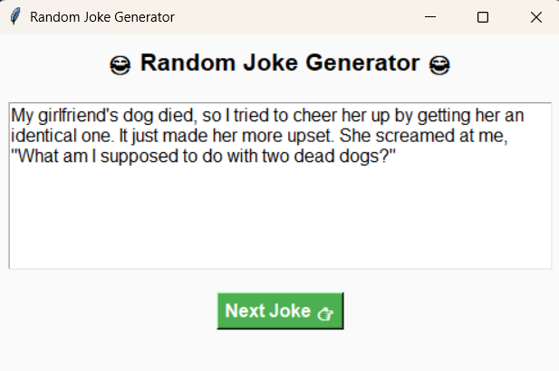

# 😂 Random Joke Generator

A fun Python GUI app that fetches random jokes from the **JokeAPI** and displays them using **Tkinter**.  
This project is a simple and lighthearted contribution for **Hacktoberfest 2025**!

---

## 📜 What the Script Does

- Fetches random jokes (either single-line or two-part) from the **JokeAPI**.
- Displays the joke in a clean Tkinter GUI window.
- Includes a “Next Joke 👉” button to get a new random joke each time.
- Handles errors gracefully if the API request fails.

---

## 🛠️ How to Run the Script

### **1️⃣ Prerequisites**
Make sure you have **Python 3** installed.  
You’ll also need to install the `requests` library if it isn’t already installed.

To install it, open your terminal or PowerShell and run:
```bash
pip install requests
```
---

### **Screenshot Example**

